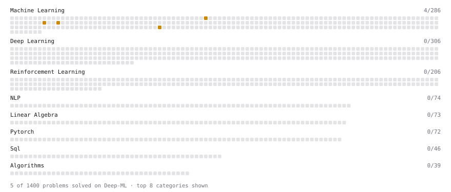

# Deep-ML

My machine learning practice from [Deep-ML](https://www.deep-ml.com). Every solution here was written by hand.

**15** solved · 10 problems · 0 labs · 5 math

[**Browse the interactive portfolio**](https://vtnguyen04.github.io/deep-ml/) to replay this filling in over time.

## Problems

| | Difficulty | Solved | |
| --- | --- | --- | --- |
| [Create a Float Tensor from a Python List](https://www.deep-ml.com/problems/880) | easy | 2026-09-16 | [solution](problems/0880-create-a-float-tensor-from-a-python-list) |
| [Implement Weight Decay as L2 Regularization](https://www.deep-ml.com/problems/198) | easy | 2026-09-15 | [solution](problems/0198-implement-weight-decay-as-l2-regularization) |
| [Reshape and Transpose a Tensor](https://www.deep-ml.com/problems/881) | easy | 2026-09-16 | [solution](problems/0881-reshape-and-transpose-a-tensor) |
| [Calculate Explained Variance Ratio for PCA](https://www.deep-ml.com/problems/350) | medium | 2026-09-15 | [solution](problems/0350-calculate-explained-variance-ratio-for-pca) |
| [Elastic Net Regression via Gradient Descent](https://www.deep-ml.com/problems/139) | medium | 2026-09-15 | [solution](problems/0139-elastic-net-regression-via-gradient-descent) |
| [Implement Stratified K-Fold Cross-Validation](https://www.deep-ml.com/problems/840) | medium | 2026-09-15 | [solution](problems/0840-implement-stratified-k-fold-cross-validation) |
| [Implement the Huber Loss Function](https://www.deep-ml.com/problems/192) | medium | 2026-09-15 | [solution](problems/0192-implement-the-huber-loss-function) |
| [Polynomial Regression Fit](https://www.deep-ml.com/problems/801) | medium | 2026-09-15 | [solution](problems/0801-polynomial-regression-fit) |
| [Principal Component Analysis (PCA) Implementation](https://www.deep-ml.com/problems/19) | medium | 2026-09-15 | [solution](problems/0019-principal-component-analysis-pca-implementation) |
| [Reconstruction Error from PCA](https://www.deep-ml.com/problems/353) | medium | 2026-09-15 | [solution](problems/0353-reconstruction-error-from-pca) |

## Math

| | Difficulty | Solved | |
| --- | --- | --- | --- |
| [Model Selection: CV, AIC, and BIC](https://www.deep-ml.com/math-problems/43) | easy | 2026-09-15 | [solution](math/0043-model-selection-cv-aic-and-bic) |
| [Bias–Variance Decomposition](https://www.deep-ml.com/math-problems/39) | medium | 2026-09-15 | [solution](math/0039-bias-variance-decomposition) |
| [Information Theory: Entropy](https://www.deep-ml.com/math-problems/24) | medium | 2026-09-15 | [solution](math/0024-information-theory-entropy) |
| [Optimization: Convexity and Critical Points](https://www.deep-ml.com/math-problems/6) | medium | 2026-09-15 | [solution](math/0006-optimization-convexity-and-critical-points) |
| [Maximum Likelihood and MAP](https://www.deep-ml.com/math-problems/26) | hard | 2026-09-15 | [solution](math/0026-maximum-likelihood-and-map) |

---

_This file is regenerated by Deep-ML on every push._
